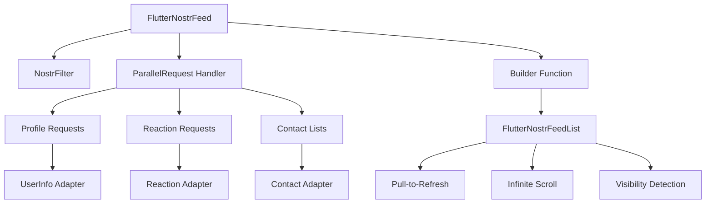

# 🚀 flutter_nostr

<div align="center">


**Beautiful, pragmatic Flutter primitives for building Nostr-powered feeds and social UX**

[📖 Documentation](#-documentation) • [🎯 Quick Start](#-quick-start) • [💡 Examples](#-examples) • [🔧 API Reference](#-api-reference) • [🤝 Contributing](#-contributing)

</div>

---

## ✨ What is flutter_nostr?

`flutter_nostr` is a powerful Flutter package that provides **building blocks** for creating Nostr-powered social applications. It handles the complexity of fetching events, enriching them with related data, and rendering them in beautiful, performant Flutter widgets.

### 🎯 Key Features

- 🔄 **Parallel Data Fetching**: Efficiently fetch related data (profiles, reactions, etc.) using typed parallel requests
- 📱 **Flutter-Native**: Built specifically for Flutter with proper state management and widget lifecycle
- 🎨 **Customizable**: Flexible builder patterns and adapters for any data structure
- ⚡ **Performant**: Smart caching, pagination, and visibility-based loading
- 🔗 **Type-Safe**: Full TypeScript-like type safety with Dart generics
- 📚 **Example-Rich**: Complete example app with multiple use cases

### 🏗️ Architecture Overview



---

## 🚀 Quick Start

### 1. Installation

Add to your `pubspec.yaml`:

```yaml
dependencies:
  flutter_nostr: ^0.1.0
```

### 2. Initialize

```dart
import 'package:flutter/material.dart';
import 'package:flutter_nostr/flutter_nostr.dart';

void main() async {
  // Initialize with one or more relays
  await FlutterNostr.init(relays: [
    'wss://relay.nostr.band',
    'wss://nos.lol',
  ]);

  runApp(const MyApp());
}
```

### 3. Basic Feed

```dart
class MyFeedScreen extends StatelessWidget {
  @override
  Widget build(BuildContext context) {
    return Scaffold(
      appBar: AppBar(title: Text('Nostr Feed')),
      body: FlutterNostrFeed(
        filters: [
          NostrFilter(
            kinds: [1], // Text notes
            limit: 20,
          ),
        ],
        builder: (context, data, options) => FlutterNostrFeedList(
          data: data,
          options: options,
          itemBuilder: (context, event, index, data, options) {
            return Card(
              child: ListTile(
                title: Text(event.content ?? 'No content'),
                subtitle: Text('by ${event.pubkey.substring(0, 8)}...'),
                trailing: Text(
                  DateFormat('HH:mm').format(
                    DateTime.fromMillisecondsSinceEpoch(event.createdAt),
                  ),
                ),
              ),
            );
          },
        ),
      ),
    );
  }
}
```

**That's it!** 🎉 You now have a fully functional Nostr feed with:

- ✅ Pull-to-refresh
- ✅ Infinite scroll
- ✅ Loading states
- ✅ Error handling

---

## 💡 Examples

### 📱 Example 1: Simple Feed (No Parallel Requests)

Perfect for basic use cases where you just want to display events.

```dart
FlutterNostrFeed(
  filters: [NostrFilter(kinds: [1], limit: 10)],
  builder: (context, data, options) => FlutterNostrFeedList(
    data: data,
    options: options,
    itemBuilder: (context, event, index, data, options) {
      return ListTile(
        title: Text(event.content ?? 'No content'),
        subtitle: Text('Author: ${event.pubkey.substring(0, 8)}...'),
      );
    },
  ),
)
```

### 👤 Example 2: Feed with User Profiles (Single Layer)

Enrich your feed with user profile information.

```dart
// Define a request ID for type safety
final profileRequestId = ParallelRequestId<UserInfo>(id: 'profiles');

FlutterNostrFeed(
  filters: [NostrFilter(kinds: [1], limit: 10)],
  parallelRequestRequestsHandler: (parallelResults, events) {
    return ParallelRequest<UserInfo>(
      id: profileRequestId,
      filters: [
        NostrFilter(
          kinds: [0], // Profile events
          authors: events.map((e) => e.pubkey).toList(),
        ),
      ],
      adapter: (event) => UserInfo.fromEvent(event),
    );
  },
  builder: (context, data, options) {
    return FlutterNostrFeedList(
      data: data,
      options: options,
      itemBuilder: (context, event, index, data, options) {
        // Get profile data
        final profiles = data
            .locateParallelRequestResultsById(profileRequestId)
            ?.adaptedResults ?? [];

        final userProfile = profiles.firstWhere(
          (profile) => profile.pubkey == event.pubkey,
          orElse: () => UserInfo.empty(),
        );

        return Card(
          child: ListTile(
            leading: CircleAvatar(
              backgroundImage: userProfile.picture.isNotEmpty
                  ? NetworkImage(userProfile.picture)
                  : null,
              child: userProfile.picture.isEmpty
                  ? Text(userProfile.name.isNotEmpty
                      ? userProfile.name[0].toUpperCase()
                      : event.pubkey[0].toUpperCase())
                  : null,
            ),
            title: Text(userProfile.name.isNotEmpty
                ? userProfile.name
                : event.pubkey.substring(0, 8) + '...'),
            subtitle: Text(event.content ?? 'No content'),
          ),
        );
      },
    );
  },
)
```

### 🔗 Example 3: Multi-Layer Parallel Requests (Advanced)

Chain multiple requests to build complex data relationships.

```dart
final profileRequestId = ParallelRequestId<UserInfo>(id: 'profiles');
final followingsRequestId = ParallelRequestId<UserFollowings>(id: 'followings');

FlutterNostrFeed(
  filters: [NostrFilter(kinds: [1], limit: 10)],
  parallelRequestRequestsHandler: (parallelResults, events) {
    return ParallelRequest<UserInfo>(
      id: profileRequestId,
      filters: [
        NostrFilter(
          kinds: [0],
          authors: events.map((e) => e.pubkey).toList(),
        ),
      ],
      adapter: (event) => UserInfo.fromEvent(event),
    ).then<UserFollowings>((profiles) {
      // Chain: after profiles are fetched, fetch their followings
      return ParallelRequest<UserFollowings>(
        id: followingsRequestId,
        filters: [
          NostrFilter(
            kinds: [3], // Contact lists
            authors: profiles.map((p) => p.pubkey).toList(),
          ),
        ],
        adapter: (event) => UserFollowings.fromEvent(event),
      );
    });
  },
  builder: (context, data, options) {
    return FlutterNostrFeedList(
      data: data,
      options: options,
      itemBuilder: (context, event, index, data, options) {
        final profiles = data
            .locateParallelRequestResultsById(profileRequestId)
            ?.adaptedResults ?? [];

        final followings = data
            .locateParallelRequestResultsById(followingsRequestId)
            ?.adaptedResults ?? [];

        final userProfile = profiles.firstWhere(
          (profile) => profile.pubkey == event.pubkey,
          orElse: () => UserInfo.empty(),
        );

        final userFollowings = followings.firstWhere(
          (following) => following.pubkey == event.pubkey,
          orElse: () => UserFollowings(pubkey: '', followings: []),
        );

        return Card(
          child: ListTile(
            leading: CircleAvatar(
              backgroundImage: userProfile.picture.isNotEmpty
                  ? NetworkImage(userProfile.picture)
                  : null,
            ),
            title: Text(userProfile.name.isNotEmpty
                ? userProfile.name
                : event.pubkey.substring(0, 8) + '...'),
            subtitle: Column(
              crossAxisAlignment: CrossAxisAlignment.start,
              children: [
                Text(event.content ?? 'No content'),
                SizedBox(height: 4),
                Text(
                  '${userFollowings.followings.length} following',
                  style: TextStyle(
                    fontSize: 12,
                    color: Colors.grey[600],
                  ),
                ),
              ],
            ),
          ),
        );
      },
    );
  },
)
```

---

## 🔧 API Reference

### Core Classes

#### `FlutterNostr`

Main entry point for the package.

```dart
class FlutterNostr {
  static Future<void> init({required List<String> relays});
  static NostrService get instance;
}
```

#### `FlutterNostrFeed`

The main feed widget that handles data fetching and rendering.

```dart
FlutterNostrFeed({
  required List<NostrFilter> filters,
  ParallelRequestRequestsHandler? parallelRequestRequestsHandler,
  required FeedBuilder builder,
})
```

**Parameters:**

- `filters`: List of Nostr filters to query events
- `parallelRequestRequestsHandler`: Optional handler for parallel data fetching
- `builder`: Function that builds the UI with fetched data

#### `FlutterNostrFeedList`

A list widget with built-in pagination, pull-to-refresh, and visibility detection.

```dart
FlutterNostrFeedList({
  required FeedBuilderData data,
  required FeedBuilderOptions options,
  required FeedItemBuilder itemBuilder,
})
```

**Parameters:**

- `data`: Contains the fetched events and parallel request results
- `options`: Provides methods for loading more data and refreshing
- `itemBuilder`: Function that builds individual list items

#### `ParallelRequest<T>`

Represents a parallel data request with type safety.

```dart
ParallelRequest<T>({
  required ParallelRequestId<T> id,
  required List<NostrFilter> filters,
  required T Function(NostrEvent) adapter,
})
```

**Methods:**

- `.then<U>()`: Chain another request that depends on this one's results

#### `ParallelRequestId<T>`

Type-safe identifier for parallel requests.

```dart
ParallelRequestId<T>({required String id})
```

### Data Models

#### `FeedBuilderData`

Contains all the data available in the builder function.

```dart
class FeedBuilderData {
  List<NostrEvent> events;
  List<ParallelRequestResult> parallelRequestResults;

  ParallelRequestResult? locateParallelRequestResultsById<T>(
    ParallelRequestId<T> id
  );
}
```

#### `FeedBuilderOptions`

Provides methods for data loading and refresh.

```dart
class FeedBuilderOptions {
  Future<void> loadMore();
  Future<void> refresh();
  bool get isLoading;
  bool get hasError;
}
```

---

## 🎮 Example App

The package includes a comprehensive example app with three different screens:

### 🏠 Home Screen

Navigation hub with links to all example screens.

### 📱 Simple Feed Screen

- Basic event display
- Link detection
- No parallel requests

### 👤 Single Layer Parallel Feed Screen

- Profile enrichment
- Avatar display
- User name resolution

### 🔗 Multi Layer Parallel Feed Screen

- Chained requests (profiles → followings)
- Complex data relationships
- Following count display

### 🚀 Running the Example

```bash
cd example
flutter pub get
flutter run
```

---

## 🎯 Use Cases

### Social Media Apps

- **Twitter-like feeds**: Text notes with profiles and reactions
- **Instagram-style**: Media posts with user information
- **Reddit clones**: Threaded discussions with voting

### Community Platforms

- **Forums**: Topic-based discussions with user profiles
- **Chat rooms**: Real-time messaging with user presence
- **Event platforms**: Event announcements with attendee lists

### Content Discovery

- **News aggregators**: Article sharing with author profiles
- **Blog platforms**: Long-form content with social features
- **Podcast apps**: Episode sharing with host information

---

## 🛠️ Advanced Topics

### Error Handling

```dart
FlutterNostrFeed(
  builder: (context, data, options) {
    if (options.hasError) {
      return Center(
        child: Column(
          mainAxisAlignment: MainAxisAlignment.center,
          children: [
            Icon(Icons.error, size: 64, color: Colors.red),
            SizedBox(height: 16),
            Text('Failed to load feed'),
            SizedBox(height: 8),
            ElevatedButton(
              onPressed: options.refresh,
              child: Text('Retry'),
            ),
          ],
        ),
      );
    }

    return FlutterNostrFeedList(/* ... */);
  },
)
```

### Custom Adapters

```dart
class CustomUserInfo {
  final String name;
  final String avatar;
  final int followers;

  CustomUserInfo({required this.name, required this.avatar, required this.followers});

  factory CustomUserInfo.fromEvent(NostrEvent event) {
    final content = jsonDecode(event.content ?? '{}') as Map<String, dynamic>;

    return CustomUserInfo(
      name: content['display_name'] ?? content['name'] ?? 'Anonymous',
      avatar: content['picture'] ?? '',
      followers: _extractFollowersCount(event),
    );
  }

  static int _extractFollowersCount(NostrEvent event) {
    // Custom logic to extract follower count
    return event.tags?.where((tag) => tag[0] == 'p').length ?? 0;
  }
}
```

### Performance Optimization

```dart
// Use smaller limits during development
NostrFilter(kinds: [1], limit: 5) // Instead of 50

// Cache parallel request results
class CachedFeedScreen extends StatefulWidget {
  @override
  _CachedFeedScreenState createState() => _CachedFeedScreenState();
}

class _CachedFeedScreenState extends State<CachedFeedScreen> {
  Map<String, dynamic> _cache = {};

  @override
  Widget build(BuildContext context) {
    return FlutterNostrFeed(
      parallelRequestRequestsHandler: (results, events) {
        // Check cache first
        final cacheKey = events.map((e) => e.pubkey).join(',');
        if (_cache.containsKey(cacheKey)) {
          return null; // Skip request
        }

        return ParallelRequest<UserInfo>(/* ... */);
      },
      builder: (context, data, options) {
        // Use cached data when available
        return FlutterNostrFeedList(/* ... */);
      },
    );
  }
}
```

---

## 🤝 Contributing

We welcome contributions! Here's how you can help:

### 🐛 Bug Reports

- Use the issue template
- Include steps to reproduce
- Provide Flutter/Dart version info

### 💡 Feature Requests

- Describe the use case
- Explain why it would be valuable
- Consider contributing a PR

### 🔧 Pull Requests

- Fork the repository
- Create a feature branch
- Add tests for new functionality
- Update documentation
- Submit a PR with a clear description

### 📚 Example Contributions

Especially valuable contributions:

- New example screens demonstrating real use cases
- Performance optimizations
- Additional adapter examples
- Error handling improvements

---

## 📋 Roadmap

### 🎯 Version 0.2

- [ ] Chat primitives (NIP-44)
- [ ] Identity helpers and key management
- [ ] Enhanced error handling
- [ ] Performance improvements

### 🚀 Future Versions

- [ ] Payment integration (Lightning)
- [ ] NostrConnect support
- [ ] Relay moderation tools
- [ ] Advanced caching strategies
- [ ] WebSocket connection pooling

---

## 📄 License

This project is licensed under the MIT License - see the [LICENSE](LICENSE) file for details.

---

## 🙏 Acknowledgments

- Built on top of the excellent [dart_nostr](https://pub.dev/packages/dart_nostr) package
- Inspired by the Nostr protocol's simplicity and power
- Community feedback and contributions

---

<div align="center">

**Made with ❤️ for the Nostr community**

[⭐ Star this repo](https://github.com/your-username/flutter_nostr) • [🐛 Report issues](https://github.com/your-username/flutter_nostr/issues) • [💬 Join discussions](https://github.com/your-username/flutter_nostr/discussions)

</div>
